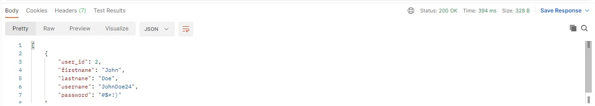
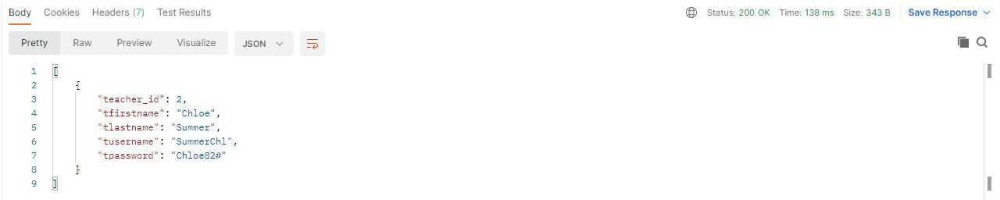
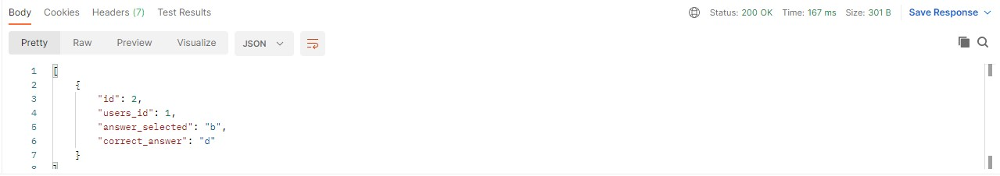
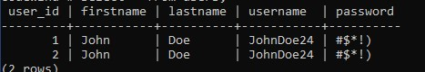
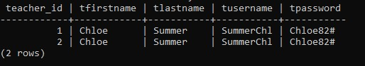
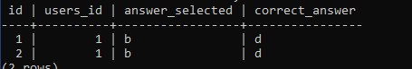

# Problem Statement: Add data into a Database
## Group Members

1. ###### @Mega-Barrel - saurabhjoshi7869@gmail.com
    - Worked on creating the code for the API to insert data into postgresql database.
    - Fixed bugs that caused data not be inserted to the database.
    - Helped @so-bit to create postgreSQL schema.
    - 
2. ###### @himanshu-patil - himanshu15122000@gmail.com 
   - After I had a word with the group members, I made the connectivity part of the database by creating a file (**db.js**) for the connection to the PostgreSQL database.

3. ###### @so-bit - sonalbijitkar2015@gmail.com 
   - Downloaded and Created the PostgreSQL database schema and tables required as per problem statement.

4. ###### @Shubhamcm - shubham.c.mishra@icloud.com
   - Created Project boilerplate files and helped in writing JS codes.
   - Helped in Database design and Working of the Application.  

5. ###### @Archana70 - archanapotraj7050@gmail.com
   - Discussed with group members in which direction we have to work.
   - Learn working of Git.
   - Explored technical aspects for developing solution and designing it.

6. ###### @rohitlotilkar - lotlikar.rohit50@gmail.com
   - Deciding the schemas for the database, Create the table in the database, learning to connect node js with postgres database
   - Worked on Database connection  to Node js. Helped inserting dummy data in the tables for testing.
   - Helped other group member to create question page which extracts the created questions from database and options of the question, Created a form interface to take input    from user as a answer and direct that answer to a different route so that answer can be comitted to a database. 
   - Created a interface to display all the question and their respective options. 
   - Collected all the inputs from the user an and stored it in a javascript object.
   - Created the logic for entering the user input data into the database and check if the data is already entered or not. 
   - Created Code to enter the information in exam table as to extract the results of the exam taken by the user

## Initial Setup
1. #### Node Setup
    - Run `npm install` to install all the dependant packages to run the app.
2. #### Database Setup 
   - Install PostgreSQL, and create following tables:
   - `users`, `answers` and `teachers`
   - Follow the code written in `Database/main.sql` and copy and paste the code in the codewind database.
  
3. #### Dotenv Setup
    - Create a `.env` file on your local system and add the following contents in the file
    - ```user = postgresql username
         password = postgresql password
         database = database Name
         host = localhost
         port = portnumber
        ```
    - Make sure you are adding the right details in the `.env` file.

4. #### Postman Setup
    - Download and Install the Postman app, which will require to add our data values.

## Running the App
1. Type the following command in yout terminal
`nodemon index.js` 

2. Open **Postman Application**, Create a New Application and Click on **API** and give your API a name -> Select **Schema format** to ***JSON***.

3. In the URL section, Select **POST** and paste the following link:

   - Type the following JSON code for inserting UsersData.
     - Paste this Link in **Postman** URL tab: **http://localhost:5000/userRegister**.
       ```JSON
           {
               "firstname": "John",
               "lastname": "Doe",
               "username": "JohnDoe24",
               "password": "#$*!)"
           } 
       ```

   - Type the following JSON code for inserting Teachers data.
     - Paste this Link in **Postman** URL tab: **http://localhost:5000/teacherRegister**.
       ```JSON
           {
               "tfirstname": "Chloe",
               "tlastname": "Summer",
               "tusername": "SummerChl",
               "tpassword": "Chloe82#"
           }
       ```
   - Type the following JSON code for inserting answers data.
     - Paste this Link in **Postman** URL tab: **http://localhost:5000/userAnswers**.
       ```JSON
           {
               "users_id": 1,
               "answer_selected": "b",
               "correct_answer": "d"
           } 
       ```

4. Verification Phase
   - Check with the database if record is inserted or not.
   - You will also get a status code in Postman Application to verify if data has been inserted or not.

## Screenshots

1. #### Postman
   User Status
   
    
   Teacher Status
   
   
   Answer Status
   

2. #### Database
   Users Database

   

   Teachers Database
   
   

   Answers Database
   
   
